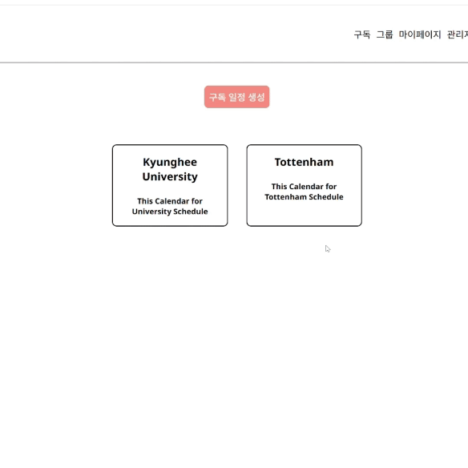

# Spring boot + React Project

## Overview
This project comprises both a backend developed using Spring Boot and a frontend developed using React. It serves as an online calendar application where users can manage their schedules and events.

## Backend

### Backend Technologies
- Spring Boot: 3.1.0
- Spring Data JPA
- Spring Security
- MySQL Connector Java: 8.0.32
- Jackson Module Kotlin
- JWT

## Frontend

### Frontend Technologies
- React: 18.2.0
- React Router Dom: 6.20.1
- Material-UI: 5.15.10
- Axios: 1.6.2
- Ant Design: 5.14.2
- React Big Scheduler: 0.2.7

## Features

### User authentication and authorization

### Event creation, modification, and deletion

|  |  |
| :------------------------------------: | :------------------------------------------: |
|               Create                   |                 Drag & Drop                   |

|  |  |
| :-------------------------------: | :-----------------------------------: |
|               Edit                |                Delete                 |

- Group Scheduler Service

- Subscribe Calendars

## Setup Instructions
### Backend Setup
1. Install JDK (Java Development Kit).
2. Configure database settings in `application.yml`.
3. Run the Spring Boot application.

### Frontend Setup
1. Install Node.js.
2. Navigate to the `frontend` directory.
3. Install dependencies using `npm install`.
4. Start the development server with `npm start`.

## Running the Project
1. Start the backend server.
2. Start the frontend development server.
3. Access the application at `http://localhost:3000`.

## Additional Information
- This project is licensed under the MIT License.
- For any inquiries, please contact [min1925k@gmail.com].

